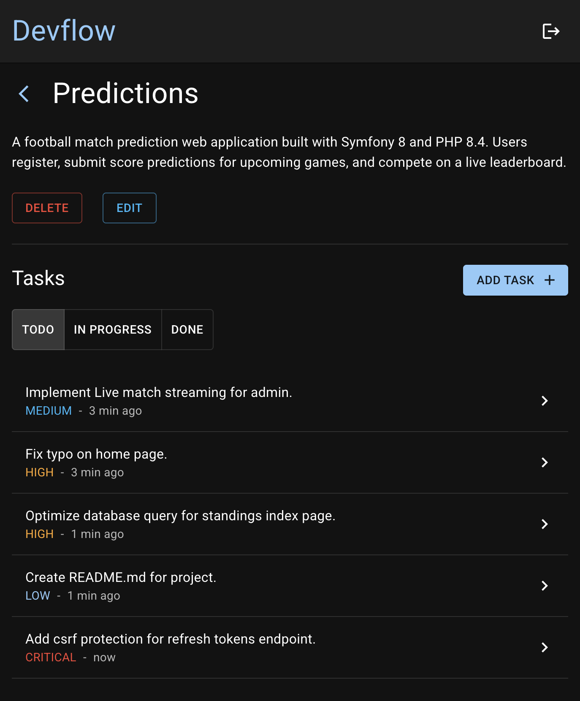

# Devflow

A task management application for software projects. Organize your work by creating projects, adding tasks with priorities and types, and tracking progress through statuses.

## App screenshot

## Features

- **Authentication** — register, login, and persistent sessions via JWT access tokens with HTTP-only refresh cookies
- **Projects** — create and manage multiple software projects per user
- **Tasks** — full CRUD with status, type, and priority classification
  - Status: `TODO` · `IN_PROGRESS` · `DONE`
  - Type: `BUG` · `FEATURE` · `REFACTOR` · `TEST` · `DOCUMENTATION` · `OPTIMIZATION`
  - Priority: `LOW` · `MEDIUM` · `HIGH` · `CRITICAL`
- **Filtering** — filter tasks by status within a project

## Tech Stack

### Backend (`/api`)
- **FastAPI** — REST API with automatic OpenAPI docs
- **SQLAlchemy** — ORM with PostgreSQL
- **Alembic** — database migrations
- **Pydantic** — request/response validation
- **PyJWT + argon2** — JWT authentication and password hashing
- **Docker** — containerized API and PostgreSQL (via Compose)
- **PyTest** - testing

### Frontend (`/web-app`)
- **React 19** + **TypeScript** — UI
- **Vite** — build tooling
- **Material UI** — component library
- **React Router v7** — client-side routing
- **React Hook Form** + **Zod** — form handling and validation

## API Overview

| Method | Endpoint | Description |
|--------|----------|-------------|
| POST | `/auth/register` | Register a new user |
| POST | `/auth/login` | Login and receive tokens |
| POST | `/auth/refresh` | Refresh access token |
| GET | `/api/projects` | List user's projects |
| POST | `/api/projects` | Create a project |
| PUT | `/api/projects/{id}` | Update a project |
| DELETE | `/api/projects/{id}` | Delete a project |
| GET | `/api/tasks?project={id}&status={status}` | List tasks filtered by status |
| POST | `/api/tasks` | Create a task |
| PUT | `/api/tasks/{id}` | Update a task |
| PATCH | `/api/tasks/{id}` | Partially update a task (e.g. change status) |
| DELETE | `/api/tasks/{id}` | Delete a task |

